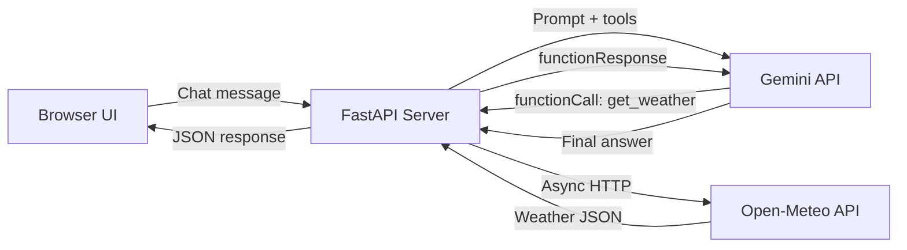

# Real-Time Weather & Wardrobe Assistant

A conversational AI agent that fetches live weather data via function calling and recommends outfits based on current conditions and user preferences.

## Background & Architecture

### Core Concept
The user types a natural-language query (e.g. *"What should I wear in Tokyo tomorrow?"*). The Gemini model **autonomously decides** it needs live weather data, **pauses** text generation, emits a `functionCall` for `get_weather`, our code executes the call against a real API, and the result is fed back so Gemini can compose a personalized wardrobe recommendation.

### High-Level Architecture



### Technology Choices

| Layer | Choice | Rationale |
|-------|--------|-----------|
| **Frontend** | Vanilla HTML/CSS/JS (static files) | No build step, served directly by FastAPI, pure HTML/CSS/JS |
| **Backend** | Python + FastAPI | Modern async framework, auto-generated docs, type hints, Pydantic validation |
| **ASGI Server** | Uvicorn | High-performance async server for FastAPI |
| **AI Model** | Gemini 2.5 Flash (free tier) | Supports function calling, generous free quota |
| **Weather API** | Open-Meteo | **No API key required**, free, high-resolution global data |
| **Geocoding** | Open-Meteo Geocoding API | Converts city names → lat/lon, also free and keyless |
| **HTTP Client** | httpx | Async-native HTTP client for Python |
| **Styling** | Vanilla CSS (dark glassmorphism) | Premium aesthetic, no dependencies |

---

## User Review Required

> [!IMPORTANT]
> **Gemini API Key**: The user must provide a `GEMINI_API_KEY` environment variable. The free tier of Gemini Flash supports ~15 RPM and ~1,500 RPD, which is more than sufficient for personal use.

> [!IMPORTANT]
> **No Weather API Key Needed**: Open-Meteo requires **zero** API keys — requests are made directly to `api.open-meteo.com`. This eliminates signup friction entirely.

---

## Open Questions

> [!IMPORTANT]
> **1. Temperature Unit Preference** — Should the app default to Celsius or Fahrenheit? The plan currently defaults to **Celsius** with a toggle in preferences. Let me know if you'd prefer Fahrenheit as default.

> [!IMPORTANT]
> **2. Multi-day Forecast** — Open-Meteo supports up to 16-day forecasts. Should the wardrobe assistant recommend outfits for just **today**, or allow users to ask about upcoming days (e.g. "What should I wear on Saturday?")? Currently planned: **up to 7 days**.

> [!IMPORTANT]
> **3. Conversation History** — Should chat history persist across page refreshes (localStorage)? Currently planned: **yes**, with a "Clear Chat" button.

---

## Proposed Changes

### Project Structure

```
Real-Time_Weather_and_Wardrobe_Assistant/
├── requirements.txt              # Python dependencies
├── .env.example                  # Environment variable template
├── .gitignore
├── main.py                       # FastAPI application entry point
│
├── app/
│   ├── __init__.py
│   ├── config.py                 # Settings via pydantic-settings
│   ├── gemini.py                 # Gemini API client + function calling loop
│   ├── models.py                 # Pydantic request/response schemas
│   ├── routes/
│   │   ├── __init__.py
│   │   └── chat.py               # /api/chat and /api/health endpoints
│   ├── tools/
│   │   ├── __init__.py
│   │   ├── weather.py            # get_weather tool: calls Open-Meteo
│   │   └── geocode.py            # geocode_city tool: city → lat/lon
│   └── wardrobe.py               # Clothing recommendation logic
│
├── static/
│   ├── index.html                # Main HTML shell
│   ├── js/
│   │   └── main.js               # Frontend app logic
│   ├── css/
│   │   ├── index.css             # Design system tokens & global styles
│   │   ├── chat.css              # Chat interface styles
│   │   ├── weather-card.css      # Weather display card
│   │   └── preferences.css       # User preferences panel
│   └── assets/
│       ├── favicon.svg
│       └── (weather icons)       # Generated weather condition icons
│
└── tests/
    ├── __init__.py
    ├── test_geocode.py            # Geocoding tool tests
    ├── test_weather.py            # Weather tool tests
    └── test_chat.py               # Chat endpoint integration tests
```

---

### Backend — FastAPI Server

#### [NEW] requirements.txt

```
fastapi>=0.115.0
uvicorn[standard]>=0.34.0
google-genai>=1.14.0
httpx>=0.28.0
pydantic>=2.11.0
pydantic-settings>=2.9.0
python-dotenv>=1.1.0
pytest>=8.0.0
pytest-asyncio>=0.26.0
```

#### [NEW] .env.example

```
GEMINI_API_KEY=your_gemini_api_key_here
PORT=8000
```

#### [NEW] main.py

- Creates the FastAPI application instance
- Mounts `/static` directory via `StaticFiles` for serving frontend assets
- Includes the API router from `app.routes.chat`
- Serves `index.html` at the root route (`/`) via `FileResponse`
- Configures CORS middleware (allowing all origins during development)
- Entry point runs `uvicorn.run()` on the configured port

```python
# Pseudocode sketch
app = FastAPI(title="Weather Wardrobe Assistant")
app.add_middleware(CORSMiddleware, ...)
app.mount("/static", StaticFiles(directory="static"), name="static")
app.include_router(chat_router, prefix="/api")

@app.get("/")
async def root():
    return FileResponse("static/index.html")
```

#### [NEW] app/config.py

- Uses `pydantic-settings` `BaseSettings` to load configuration from `.env`
- Fields: `GEMINI_API_KEY: str`, `PORT: int = 8000`
- Singleton pattern via `@lru_cache`

#### [NEW] app/models.py — Pydantic Schemas

```python
class ChatRequest(BaseModel):
    message: str
    preferences: dict | None = None
    history: list[dict] | None = None

class ChatResponse(BaseModel):
    response: str
    weather_data: dict | None = None
```

#### [NEW] app/routes/chat.py

- `POST /api/chat` — accepts `ChatRequest`, invokes the Gemini agentic loop, returns `ChatResponse`
- `GET /api/health` — returns `{"status": "ok"}`
- Uses `async` handlers for non-blocking I/O

#### [NEW] app/gemini.py — *The Agentic Core*

This is the heart of the project — the **function-calling loop**:

```
1. Receive user message + conversation history
2. Initialize Gemini client with google-genai SDK
3. Configure tools: [get_weather, geocode_city]
4. Send user message to Gemini
5. LOOP:
   a. If response contains functionCall(s):
      - Execute the matching local function (weather/geocode) asynchronously
      - Send functionResponse back to Gemini
      - Continue loop
   b. If response is text:
      - Return the final text to the client
      - Break loop
```

**Tool declarations** (JSON Schema for Gemini):
- `get_weather(latitude, longitude, forecast_days)` → fetches current + daily weather
- `geocode_city(city_name)` → resolves city name to coordinates

**System prompt** will instruct Gemini to:
- Always call `geocode_city` first if the user gives a city name
- Then call `get_weather` with the coordinates
- Factor in user preferences (style, gender, sensitivity to cold/heat)
- Give specific, actionable outfit recommendations (not vague)
- Include weather summary with the recommendation

#### [NEW] app/tools/geocode.py

- Async function using `httpx.AsyncClient`
- Calls `https://geocoding-api.open-meteo.com/v1/search?name={city}&count=1`
- Returns `{ name, latitude, longitude, country, timezone }`

#### [NEW] app/tools/weather.py

- Async function using `httpx.AsyncClient`
- Calls Open-Meteo forecast API:
  ```
  https://api.open-meteo.com/v1/forecast?latitude={lat}&longitude={lon}
  &current=temperature_2m,relative_humidity_2m,apparent_temperature,
            precipitation,weather_code,wind_speed_10m,uv_index
  &daily=temperature_2m_max,temperature_2m_min,precipitation_sum,
         weather_code,wind_speed_10m_max,uv_index_max
  &forecast_days={days}&timezone=auto
  ```
- Returns structured weather data including WMO weather codes (mapped to descriptions like "Clear sky", "Rain showers", etc.)

#### [NEW] app/wardrobe.py

- **Not a separate AI call** — this is a rule-based helper that the system prompt references
- Provides wardrobe context in the system prompt so Gemini can reason about clothing
- Categories: base layers, outer layers, accessories, footwear
- Factors: temperature ranges, precipitation, wind, UV index, user's cold/heat sensitivity

---

### Frontend — Chat UI

> [!NOTE]
> The frontend is served as **static files** by FastAPI (no build step needed). All JS is vanilla — no bundler, no framework. Files live under `static/`.

#### [NEW] static/index.html

- Semantic HTML5 structure
- Three main sections:
  1. **Header** — App title, logo, settings gear icon
  2. **Chat area** — Scrollable message history with weather cards inline
  3. **Input bar** — Text input + send button, fixed at bottom
- Preferences sidebar (slides in from right)
- Meta tags for SEO
- Links to CSS files in `css/` and JS in `js/`

#### [NEW] static/js/main.js

- Chat message handling (send/receive)
- Fetches `POST /api/chat` with `fetch()` API
- Renders AI responses with markdown-like formatting
- Detects weather data in responses and renders inline **weather cards**
- Manages user preferences in localStorage
- Conversation history management (store/load/clear)
- Typing indicator animation while waiting for AI response
- Suggested quick-action chips: "What should I wear today?", "Weather in New York", "Weekend outfit plan"

#### [NEW] static/css/index.css — Design System

- **Color palette**: Deep navy/charcoal background (`#0a0e1a`), vibrant gradient accents (teal → purple), frosted glass surfaces
- **Typography**: Google Font "Inter" for body, "Outfit" for headings
- **CSS custom properties** for all tokens
- Smooth transitions on all interactive elements
- Responsive breakpoints (mobile-first)

#### [NEW] static/css/chat.css

- Message bubbles with glassmorphism (`backdrop-filter: blur`)
- User messages: gradient accent border, right-aligned
- AI messages: frosted glass, left-aligned, with subtle glow
- Typing indicator: three pulsing dots
- Smooth scroll behavior, message entrance animations

#### [NEW] static/css/weather-card.css

- Inline weather display card within chat
- Shows: temperature (large), condition icon, humidity, wind, UV
- Gradient background based on weather condition (sunny = warm gradient, rainy = cool gradient)
- Mini daily forecast row for multi-day queries

#### [NEW] static/css/preferences.css

- Slide-in panel from right side
- Form controls for:
  - **Temperature unit**: °C / °F toggle
  - **Style preference**: Casual / Business / Sporty / Formal
  - **Gender**: (affects clothing suggestions)
  - **Cold sensitivity**: slider (runs cold ↔ runs hot)
  - **Default city**: text input
- Glassmorphism card styling consistent with chat

---

### Configuration & Build

#### [NEW] .gitignore

```
__pycache__/
*.pyc
.env
.venv/
venv/
dist/
*.egg-info/
.pytest_cache/
```

---

## Visual Design Concept

The UI follows a **dark glassmorphism** theme with these characteristics:

| Element | Design |
|---------|--------|
| Background | Deep space gradient (`#0a0e1a` → `#1a1040`) with subtle animated particles |
| Chat bubbles | Frosted glass panels with `backdrop-filter: blur(20px)`, subtle border glow |
| Weather cards | Gradient cards that shift color based on conditions (warm oranges for sunny, cool blues for rain) |
| Input bar | Floating glass bar with glowing border on focus |
| Animations | Message fade-in, typing dots pulse, weather card shimmer on load |
| Accent colors | Teal (`#00d4aa`) → Purple (`#7c3aed`) gradient for interactive elements |

---

## Verification Plan

### Automated Tests (pytest)

1. **Server starts**: `uvicorn main:app` starts without errors
2. **Health check**: `GET /api/health` returns 200 with `{"status": "ok"}`
3. **Geocoding tool**: Verify `await geocode_city("London")` returns valid coordinates
4. **Weather tool**: Verify `await get_weather(51.5, -0.1, 1)` returns valid weather JSON
5. **Chat endpoint**: `POST /api/chat` with a weather question returns an AI response containing clothing recommendations

```bash
# Run all tests
pytest tests/ -v

# Run with async support
pytest tests/ -v --asyncio-mode=auto
```

### Manual Verification (Browser)

1. Open the app at `http://localhost:8000` → verify the dark glassmorphism UI renders correctly
2. Type "What should I wear in Mumbai today?" → verify:
   - Typing indicator appears
   - Response includes actual current weather data (temperature, condition)
   - Response includes specific clothing recommendations
   - Weather card renders inline
3. Open preferences → change style to "Formal" → ask again → verify recommendations shift (e.g. blazer instead of t-shirt)
4. Test mobile responsiveness (resize browser)
5. Verify conversation persists after page refresh
6. Test "Clear Chat" functionality

### Agentic Behavior Verification

The key demo: observe the **function-calling loop** in server logs:
```
→ User: "What should I wear in Paris this weekend?"
← Gemini: functionCall(geocode_city, {city_name: "Paris"})
→ Server: executes geocode → {lat: 48.85, lon: 2.35}
→ Server: sends functionResponse to Gemini
← Gemini: functionCall(get_weather, {lat: 48.85, lon: 2.35, days: 3})
→ Server: executes weather fetch → {temp: 18°C, rain: 20%, ...}
→ Server: sends functionResponse to Gemini
← Gemini: "For Paris this weekend, expect 18°C with light clouds..."
         "I'd recommend: light jacket, comfortable jeans, sneakers..."
```

---

## Quick Start

```bash
# 1. Create and activate virtual environment
python -m venv .venv
.venv\Scripts\activate        # Windows
# source .venv/bin/activate   # macOS/Linux

# 2. Install dependencies
pip install -r requirements.txt

# 3. Configure environment
cp .env.example .env
# Edit .env and add your GEMINI_API_KEY

# 4. Run the development server
uvicorn main:app --reload --port 8000

# 5. Open in browser
# http://localhost:8000
```
